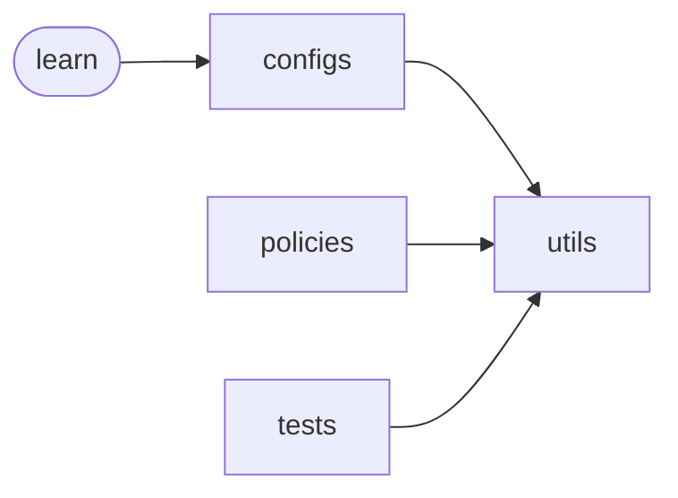

# Code Overview

[_Documentation generated by Documatic_](https://www.documatic.com)

<!---Documatic-section-Codebase Structure Python-start--->
## Codebase Structure Python

The codebase has a single-depth folder structure,
                with 20 code files in total.

<!---Documatic-block-system_architecture-start--->

<!---Documatic-block-system_architecture-end--->

# #
<!---Documatic-section-Codebase Structure Python-end--->

<!---Documatic-section-Important Functions-start--->
## Important Functions

<!---Documatic-block-important_funcs-start--->
<!---Documatic-block-most_used_funcs-start--->
### Most Utilised Functions

* [playground.utils.misc.plot_learning_curve](3-playground_utils.md#playground.utils.misc.plot_learning_curve) (6 times)
* [playground.utils.tf_ops.dense_nn](3-playground_utils.md#playground.utils.tf_ops.dense_nn) (5 times)
* [playground.utils.misc.plot_from_monitor_results](3-playground_utils.md#playground.utils.misc.plot_from_monitor_results) (1 times)
* [playground.utils.tf_ops.conv2d_net](3-playground_utils.md#playground.utils.tf_ops.conv2d_net) (1 times)
* [playground.utils.tf_ops.lstm_net](3-playground_utils.md#playground.utils.tf_ops.lstm_net) (1 times)
<!---Documatic-block-most_used_funcs-end--->
<!---Documatic-block-important_funcs-end--->

# #
<!---Documatic-section-Important Functions-end--->

<!---Documatic-section-File IO-start--->
## File IO

<!---Documatic-block-file_io-start--->
The following files have file read operations

<!---Documatic-block-playground.configs-start--->

	
<code>playground.configs</code> (Click to Expand!)

* playground.configs.manager

<!---Documatic-block-playground.configs-end--->

The following files have file write operations

<!---Documatic-block-playground.configs-start--->

	
<code>playground.configs</code> (Click to Expand!)

* playground.configs.manager

<!---Documatic-block-playground.configs-end--->
<!---Documatic-block-file_io-end--->

# #
<!---Documatic-section-File IO-end--->

<!---Documatic-section-Class Hierarchy-start--->
## Class Hierarchy

<!---Documatic-block-gym.ObservationWrapper-start--->

	
<code>gym.ObservationWrapper</code> (Click to Expand!)

* playground.utils.wrappers.DiscretizedObservationWrapper

<!---Documatic-block-gym.ObservationWrapper-end--->

<!---Documatic-block-playground.policies.actor_critic.ActorCriticPolicy-start--->

	
<code>playground.policies.actor_critic.ActorCriticPolicy</code> (Click to Expand!)

* playground.policies.actor_critic.ActorCriticPolicy
* playground.policies.ddpg.DDPGPolicy
* playground.policies.dqn.DqnPolicy
* playground.policies.ppo.PPOPolicy
* playground.policies.qlearning.QlearningPolicy
* playground.policies.reinforce.ReinforcePolicy

<!---Documatic-block-playground.policies.actor_critic.ActorCriticPolicy-end--->

<!---Documatic-block-playground.policies.base.BaseModelMixin-start--->

	
<code>playground.policies.base.BaseModelMixin</code> (Click to Expand!)

* playground.policies.actor_critic.ActorCriticPolicy

<!---Documatic-block-playground.policies.base.BaseModelMixin-end--->

<!---Documatic-block-playground.policies.base.TrainConfig-start--->

	
<code>playground.policies.base.TrainConfig</code> (Click to Expand!)

* playground.policies.base.TrainConfig

<!---Documatic-block-playground.policies.base.TrainConfig-end--->

# #
<!---Documatic-section-Class Hierarchy-end--->

[_Documentation generated by Documatic_](https://www.documatic.com)