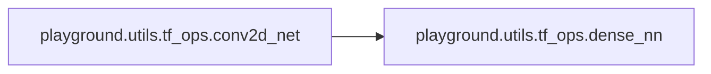
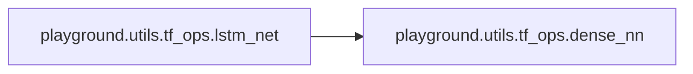

# Playground Utils

[_Documentation generated by Documatic_](https://www.documatic.com)

<!---Documatic-section-Codebase Structure-start--->
## Codebase Structure

<!---Documatic-block-system_architecture-start--->
```mermaid
None
```
<!---Documatic-block-system_architecture-end--->

# #
<!---Documatic-section-Codebase Structure-end--->

<!---Documatic-section-playground.utils.misc.plot_learning_curve-start--->
## [playground.utils.misc.plot_learning_curve](3-playground_utils.md#playground.utils.misc.plot_learning_curve)

<!---Documatic-section-plot_learning_curve-start--->
<!---Documatic-block-playground.utils.misc.plot_learning_curve-start--->
<details>
	<summary><code>playground.utils.misc.plot_learning_curve</code> code snippet</summary>

```python
def plot_learning_curve(filename, value_dict, xlabel='step'):
    fig = plt.figure(figsize=(12, 4 * len(value_dict)))
    for (i, (key, values)) in enumerate(value_dict.items()):
        ax = fig.add_subplot(len(value_dict), 1, i + 1)
        ax.plot(range(len(values)), values)
        ax.set_xlabel(xlabel)
        ax.set_ylabel(key)
        ax.grid('k--', alpha=0.6)
    plt.tight_layout()
    os.makedirs(os.path.join(REPO_ROOT, 'figs'), exist_ok=True)
    plt.savefig(os.path.join(REPO_ROOT, 'figs', filename))
```
</details>
<!---Documatic-block-playground.utils.misc.plot_learning_curve-end--->
<!---Documatic-section-plot_learning_curve-end--->

# #
<!---Documatic-section-playground.utils.misc.plot_learning_curve-end--->

<!---Documatic-section-playground.utils.tf_ops.dense_nn-start--->
## [playground.utils.tf_ops.dense_nn](3-playground_utils.md#playground.utils.tf_ops.dense_nn)

<!---Documatic-section-dense_nn-start--->
<!---Documatic-block-playground.utils.tf_ops.dense_nn-start--->
<details>
	<summary><code>playground.utils.tf_ops.dense_nn</code> code snippet</summary>

```python
def dense_nn(inputs, layers_sizes, name='mlp', reuse=False, output_fn=None, dropout_keep_prob=None, batch_norm=False, training=True):
    print(colorize('Building mlp {} | sizes: {}'.format(name, [inputs.shape[0]] + layers_sizes), 'green'))
    with tf.variable_scope(name, reuse=reuse):
        out = inputs
        for (i, size) in enumerate(layers_sizes):
            print('Layer:', name + '_l' + str(i), size)
            if i > 0 and dropout_keep_prob is not None and training:
                out = tf.nn.dropout(out, dropout_keep_prob)
            out = tf.layers.dense(out, size, activation=tf.nn.relu if i < len(layers_sizes) - 1 else None, kernel_initializer=tf.contrib.layers.xavier_initializer(), name=name + '_l' + str(i), reuse=reuse)
            if batch_norm:
                out = tf.layers.batch_normalization(out, training=training)
        if output_fn:
            out = output_fn(out)
    return out
```
</details>
<!---Documatic-block-playground.utils.tf_ops.dense_nn-end--->
<!---Documatic-section-dense_nn-end--->

# #
<!---Documatic-section-playground.utils.tf_ops.dense_nn-end--->

<!---Documatic-section-playground.utils.misc.plot_from_monitor_results-start--->
## [playground.utils.misc.plot_from_monitor_results](3-playground_utils.md#playground.utils.misc.plot_from_monitor_results)

<!---Documatic-section-plot_from_monitor_results-start--->
<!---Documatic-block-playground.utils.misc.plot_from_monitor_results-start--->
<details>
	<summary><code>playground.utils.misc.plot_from_monitor_results</code> code snippet</summary>

```python
def plot_from_monitor_results(monitor_dir, window=10):
    assert os.path.exists(monitor_dir)
    if monitor_dir.endswith('/'):
        monitor_dir = monitor_dir[:-1]
    data = load_results(monitor_dir)
    n_episodes = len(data['episode_lengths'])
    assert n_episodes > 0
    (fig, (ax1, ax2)) = plt.subplots(2, 1, figsize=(12, 8), tight_layout=True, sharex=True)
    ax1.plot(range(n_episodes), pd.rolling_mean(np.array(data['episode_lengths']), window))
    ax1.set_xlabel('episode')
    ax1.set_ylabel('episode length')
    ax1.grid('k--', alpha=0.6)
    ax2.plot(range(n_episodes), pd.rolling_mean(np.array(data['episode_rewards']), window))
    ax2.set_xlabel('episode')
    ax2.set_ylabel('episode reward')
    ax2.grid('k--', alpha=0.6)
    os.makedirs(os.path.join(REPO_ROOT, 'figs'), exist_ok=True)
    plt.savefig(os.path.join(REPO_ROOT, 'figs', os.path.basename(monitor_dir) + '-monitor'))
```
</details>
<!---Documatic-block-playground.utils.misc.plot_from_monitor_results-end--->
<!---Documatic-section-plot_from_monitor_results-end--->

# #
<!---Documatic-section-playground.utils.misc.plot_from_monitor_results-end--->

<!---Documatic-section-playground.utils.tf_ops.conv2d_net-start--->
## [playground.utils.tf_ops.conv2d_net](3-playground_utils.md#playground.utils.tf_ops.conv2d_net)

<!---Documatic-section-conv2d_net-start--->


### Object Calls

* [playground.utils.tf_ops.dense_nn](3-playground_utils.md#playground.utils.tf_ops.dense_nn)

<!---Documatic-block-playground.utils.tf_ops.conv2d_net-start--->
<details>
	<summary><code>playground.utils.tf_ops.conv2d_net</code> code snippet</summary>

```python
def conv2d_net(inputs, layers_sizes, name='conv2d', conv_layers=2, with_pooling=True, dropout_keep_prob=None, training=True):
    print(colorize('Building conv net ' + name, 'green'))
    print('inputs.shape =', inputs.shape)
    with tf.variable_scope(name):
        for i in range(conv_layers):
            inputs = tf.layers.conv2d(inputs, 32, [5, 5], strides=[2, 2], name='conv' + str(i))
            print('conv' + str(i) + '.shape =', inputs.shape)
            if with_pooling:
                inputs = tf.layers.max_pooling2d(inputs, [2, 2], 2, name='pool' + str(i))
                print('pool' + str(i) + '.shape =', inputs.shape)
        flatten = tf.reshape(inputs, [-1, np.prod(inputs.shape.as_list()[1:])], name='flatten')
        outputs = dense_nn(flatten, layers_sizes, name='fc', dropout_keep_prob=dropout_keep_prob)
        print('flatten.shape =', flatten.shape)
        print('outputs.shape =', outputs.shape)
    return outputs
```
</details>
<!---Documatic-block-playground.utils.tf_ops.conv2d_net-end--->
<!---Documatic-section-conv2d_net-end--->

# #
<!---Documatic-section-playground.utils.tf_ops.conv2d_net-end--->

<!---Documatic-section-playground.utils.tf_ops.lstm_net-start--->
## [playground.utils.tf_ops.lstm_net](3-playground_utils.md#playground.utils.tf_ops.lstm_net)

<!---Documatic-section-lstm_net-start--->


### Object Calls

* [playground.utils.tf_ops.dense_nn](3-playground_utils.md#playground.utils.tf_ops.dense_nn)

<!---Documatic-block-playground.utils.tf_ops.lstm_net-start--->
<details>
	<summary><code>playground.utils.tf_ops.lstm_net</code> code snippet</summary>

```python
def lstm_net(inputs, layers_sizes, name='lstm', step_size=16, lstm_layers=1, lstm_size=256, pre_lstm_dense_layer=None, dropout_keep_prob=None, training=True):
    print(colorize('Building lstm net ' + name, 'green'))
    print('inputs.shape =', inputs.shape)
    state_size = inputs.shape.as_list()[1]
    inputs = tf.reshape(inputs, [-1, step_size, state_size])
    print('reshaped inputs.shape =', inputs.shape)

    def _make_cell():
        cell = tf.nn.rnn_cell.LSTMCell(lstm_size, state_is_tuple=True, reuse=not training)
        if training and dropout_keep_prob:
            cell = tf.contrib.rnn.DropoutWrapper(cell, output_keep_prob=dropout_keep_prob)
        return cell
    with tf.variable_scope(name):
        if pre_lstm_dense_layer:
            inputs = tf.nn.relu(dense_nn(inputs, [pre_lstm_dense_layer], name='pre_lstm'))
        with tf.variable_scope('lstm_cells'):
            lstm_inputs = tf.transpose(inputs, [1, 0, 2])
            cell = tf.contrib.rnn.MultiRNNCell([_make_cell() for _ in range(lstm_layers)], state_is_tuple=True)
            (lstm_outputs, lstm_states) = tf.nn.dynamic_rnn(cell, lstm_inputs, dtype=tf.float32)
            lstm_outputs = tf.transpose(lstm_outputs, [1, 0, 2])
            print('cell =', cell)
            print('lstm_states =', lstm_states)
            print('lstm_outputs.shape =', lstm_outputs.shape)
        outputs = dense_nn(lstm_outputs, layers_sizes, name='outputs')
        print('outputs.shape =', outputs.shape)
        outputs = tf.reshape(outputs, [-1, layers_sizes[-1]])
        print('reshaped outputs.shape =', outputs.shape)
        return outputs
```
</details>
<!---Documatic-block-playground.utils.tf_ops.lstm_net-end--->
<!---Documatic-section-lstm_net-end--->

# #
<!---Documatic-section-playground.utils.tf_ops.lstm_net-end--->

[_Documentation generated by Documatic_](https://www.documatic.com)